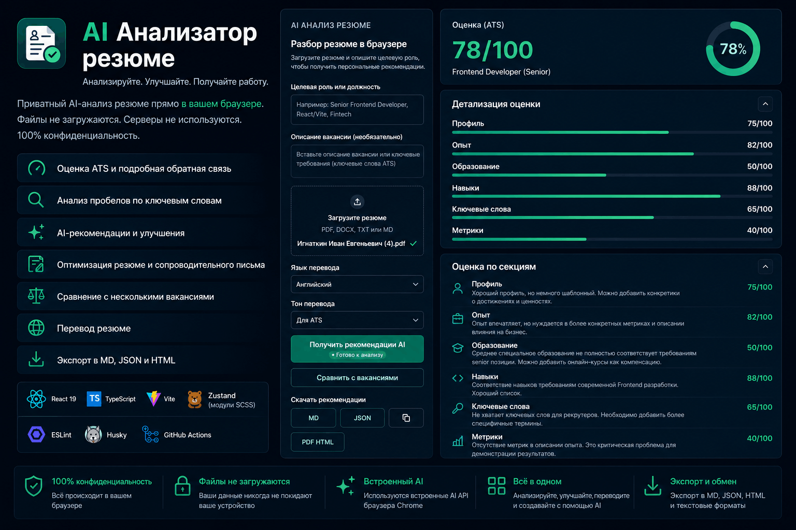

# AI Resume Review

Pet project для анализа резюме прямо в браузере. Приложение парсит файл резюме, учитывает целевую роль или вакансию и формирует практичные рекомендации через браузерный `LanguageModel` API.

**Демо:** [https://vanichh.github.io/ai-resume/](https://vanichh.github.io/ai-resume/)



Проект разработан с использованием Codex.

## Стек

- React 19
- TypeScript
- Vite
- Zustand
- SCSS Modules
- ESLint
- Husky
- GitHub Actions

## Возможности

- Загрузка резюме в форматах `PDF`, `DOCX`, `TXT`, `MD`.
- Извлечение текста на клиенте без отправки файла на сервер.
- Анализ под целевую роль и текст вакансии.
- ATS score, краткая оценка, сильные стороны и зоны роста.
- Детерминированный ATS-аудит контактов, структуры, дат, списков, метрик, объёма и покрытия вакансии.
- Поиск недостающих ключевых слов.
- Переписывание summary и bullet points.
- Создание полной исправленной версии резюме на основе результатов анализа.
- Просмотр и ручное редактирование исправленного резюме перед скачиванием.
- Экспорт исправленного резюме в DOC и HTML для последующей печати в PDF.
- Сравнение одного резюме с несколькими вакансиями.
- История анализов с локальными заметками.
- Перевод резюме с выбором языка и тона.
- История переводов.
- Генерация сопроводительного письма под роль, вакансию и анализ резюме.
- Экспорт рекомендаций в Markdown, JSON и HTML-отчет для печати в PDF.
- Экспорт перевода и сопроводительного письма в текстовые форматы.

## Поддержка браузеров

Приложение использует экспериментальный `LanguageModel` API, поэтому поддержка зависит от браузера и окружения.

Для Prompt API в Chrome могут потребоваться:

- поддерживаемая версия Chrome;
- подходящее устройство;
- включенная поддержка API;
- первичная загрузка модели в браузере.

Если API недоступен, приложение покажет подсказку с доступными действиями.

## Примечания по проекту

- Большие резюме не обрезаются слепо с начала файла: приложение пытается выделить и приоритизировать секции опыта, проектов, навыков и summary.
- Перевод длинного резюме выполняется частями, чтобы снизить риск неполного ответа модели.
- Для формального перевода приложение использует локальные `LanguageDetector` и `Translator` API, если они доступны; в остальных случаях сохраняется fallback на `LanguageModel` API.
- При создании исправленного резюме модель сохраняет исходные факты, контакты, компании, должности, даты и образование. Она не должна придумывать опыт, навыки, достижения или числовые метрики.
- История анализов, заметки, переводы, сравнения вакансий и сопроводительное письмо сохраняются локально в браузере.
- Данные обрабатываются на клиенте.
- Основной сценарий деплоя рассчитан на GitHub Pages.

## Запуск проекта

```bash
npm install
npm run dev
```

## Создание релиза

Релиз автоматически создается после push в ветку `main`, если версия из `package.json` еще не публиковалась.

Для публикации новой версии:

1. Обновите поле `version` в `package.json`, например до `0.6.0`.
2. Создайте описание `release-notes/v0.6.0.md`.
3. Закоммитьте изменения и отправьте их в `main`.

Workflow проверит проект, соберет production-версию, создаст тег `v0.6.0` и GitHub Release. Описание будет взято из соответствующего Markdown-файла, а каталог `dist` будет приложен в ZIP-архиве. Повторный push с той же версией не создаст дубликат релиза.

## Скрипты

```bash
npm run dev
npm run format
npm run format:check
npm run lint
npm run typecheck
npm run build
npm run preview
```

## Качество кода

В проекте настроены ESLint, Prettier и Husky.

Prettier отвечает за форматирование и сортировку импортов.

- `pre-commit`: запускает lint, typecheck, Stylelint, проверку форматирования и тесты.
- `pre-push`: запускает `npm run build`.

Husky устанавливается автоматически через `prepare` script после `npm install`.
